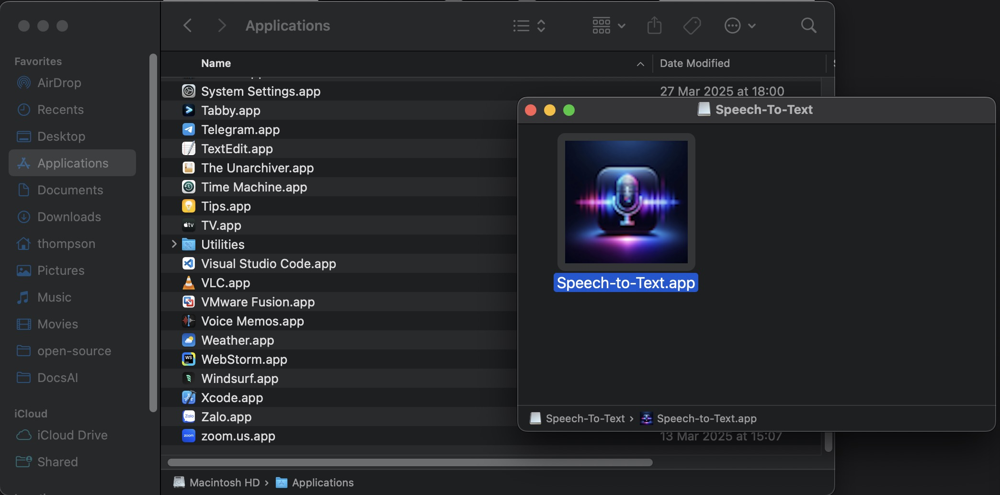

# Whisper Realtime Transcription GUI

A modern, real-time speech recognition application built with OpenAI's Whisper and PySide6. This application provides a beautiful, native-looking interface for transcribing audio in real-time with support for multiple languages.


## Download the Software

- Go to the link [https://github.com/phongthanhbuiit/whisper-realtime-gui/releases/tag/v1.0.0](https://github.com/phongthanhbuiit/whisper-realtime-gui/releases/tag/v1.0.0)
- Select your operating system and download


## Installation Guide on MacOS

- Extract the file `Speech-To-Text-macos.dmg`  
   
- Drag and drop into **Applications**
- Open the `Speech to text` app and start using it

### Fix "cannot open" issue on MacOS


- Click **Cancel**
- Access **Privacy & Security**


- Make sure **Allow applications from** _everywhere_ or _App Store & Known Developers_ is enabled
- Then open the **Speech to text** app and use normally

#### If the error persists and you still cannot open the app, use the following method:

- Open terminal

`sudo xattr -d com.apple.quarantine /Applications/Speech-to-Text.app`


- Open and use the app normally

**Note:**

- The system automatically detects the language
- If you choose a model other than **tiny**, you will need to **wait for the model to download**

### If you want the software to recognize background sound

#### For MacOS

- Select Multi-Output Device setting on MacOS

  

## Features

- 🎙 Real-time audio transcription using OpenAI's Whisper
- 🌈 Beautiful, modern UI with animated audio visualizer
- 🚀 GPU acceleration support (Apple Silicon/CUDA)
- 🌍 Multi-language support (English, French, Vietnamese)
- 📊 Live audio waveform visualization with dynamic effects
- 💫 Smooth animations and transitions
- 🎯 Multiple Whisper model options (tiny, base, small, medium, large)
- ⚡️ Optimized streaming for better real-time performance
- 🎨 Enhanced visual feedback with glowing effects

## Components

### 1. Real-time Transcription (`whisper_gui.py`)

- Modern GUI application for real-time speech recognition
- Dynamic waveform visualization with:
  - Smooth wave transitions
  - Responsive amplitude changes
  - Glowing effects during recording
- Support for multiple languages and models
- GPU acceleration for better performance
- Optimized audio streaming with 0.3s chunks
- Automatic model initialization

### 2. File Transcription (`file-to-text.py`)

- Convert audio/video files to text
- Supports multiple file formats:
  - Audio: mp3, wav, m4a, etc.
  - Video: mp4, mkv, avi, etc.
- Batch processing capability
- Output formats:
  - Plain text (.txt)
  - Microsoft Word (.docx)
  - Timestamps support

## Requirements

- Python 3.11+
- macOS (tested on Apple Silicon)
- GPU recommended for better performance

## Installation

### For macOS Users

1. Download the latest `.dmg` file from the [Releases](https://github.com/phongthanhbuiit/whisper-realtime-gui/releases) page
2. Open the downloaded `.dmg` file
3. Drag the application to your Applications folder
4. Double click to run the application

### For Developers

1. Clone the repository:

```bash
git clone https://github.com/phongthanhbuiit/whisper-realtime-gui.git
cd whisper-realtime-gui
```

2. Create and activate a virtual environment:

```bash
python -m venv venv
source venv/bin/activate  # On macOS/Linux
```

3. Install the required packages:

```bash
pip install -r requirements.txt
```

## Release Information

- Version: 1.0.0
- Release Date: 2023-02-20
- Changes:
  - Initial release with real-time transcription and file transcription features

## Usage

### Real-time Transcription

1. Activate the virtual environment if not already activated:

```bash
source venv/bin/activate  # On macOS/Linux
```

2. Run the GUI application:

```bash
python whisper_gui.py
```

3. Language is automatically detected whenever you start recording
4. Click "Start Recording" to begin transcription
5. Speak into your microphone
6. Watch the beautiful waveform animation and real-time transcription

### Model Selection

Choose from different Whisper models based on your needs:

- `tiny`: Fastest, lowest accuracy (good for testing)
- `base`: Good balance of speed and accuracy
- `small`: Better accuracy, still reasonable speed
- `medium`: High accuracy, slower processing
- `large`: Best accuracy, requires more resources

### Language Support

Currently supports:

- Auto detected language
- Follow all languages that whisper model supports

The language can be changed in real-time during transcription.

## Performance Tips

1. **Model Selection**:

   - Start with `tiny` or `base` model for testing
   - Use `small` for general use
   - Use `medium` or `large` only if you need highest accuracy

2. **GPU Acceleration**:

   - The app automatically uses GPU if available
   - Recommended for `medium` and `large` models

3. **Audio Input**:
   - Speak clearly and at a moderate pace
   - Keep microphone at a consistent distance
   - Avoid background noise for better accuracy

## Troubleshooting

If you encounter issues:

1. **Audio Not Detected**:

   - Check your microphone permissions
   - Verify input device in system settings

2. **Slow Performance**:

   - Try a smaller model
   - Ensure GPU acceleration is working
   - Check CPU/Memory usage

3. **Transcription Issues**:
   - Try changing the language setting
   - Speak more clearly
   - Adjust your microphone position

## Contributing

Contributions are welcome! Please feel free to submit a Pull Request.

## License

This project is licensed under the MIT License - see the LICENSE file for details.

## Acknowledgments

- [OpenAI Whisper](https://github.com/openai/whisper) for the amazing speech recognition model
- [PySide6](https://wiki.qt.io/Qt_for_Python) for the modern GUI framework
- [sounddevice](https://python-sounddevice.readthedocs.io/) for real-time audio processing

## Author

- Thompson Bui (@phongthanhbuiit)
- Blog: [LinkedIn](https://www.linkedin.com/in/phong-thanh-b%C3%B9i-1867b628a/)
- Twitter: [@_windsora_](https://twitter.com/_windsora_)

## Support

If you found this project helpful, please give it a ⭐️!
