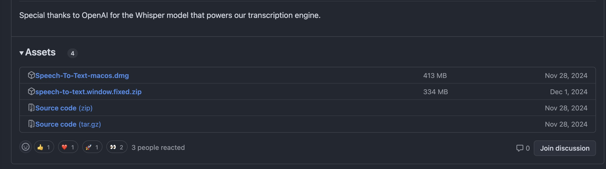
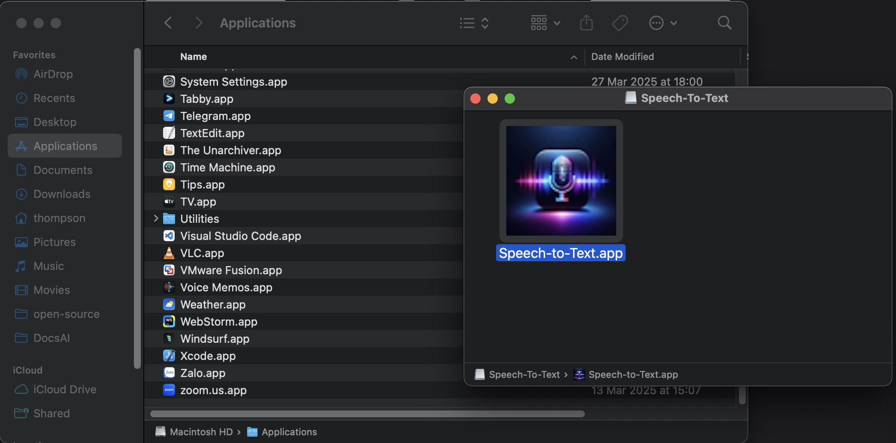
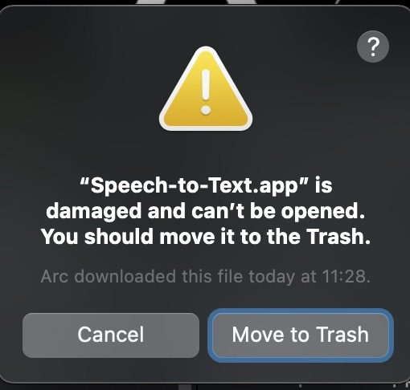
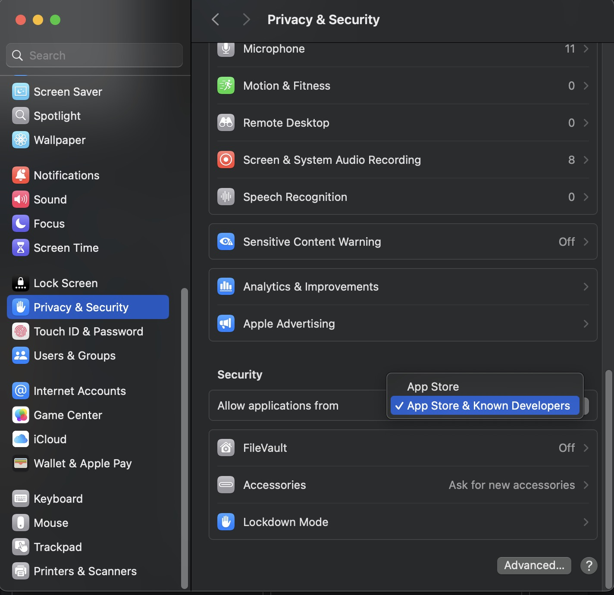
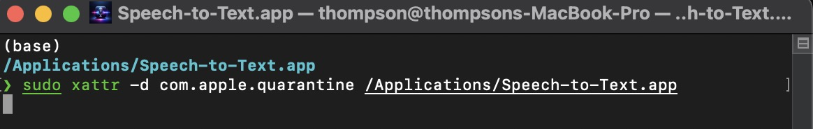
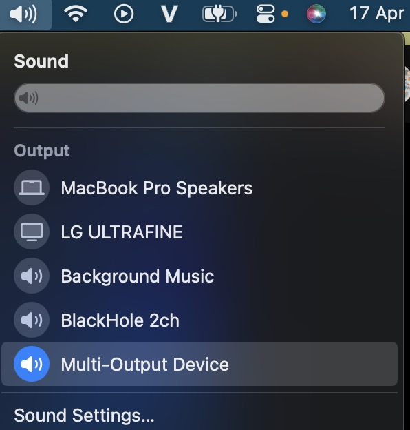

# Download the software

- Go to the link [https://github.com/phongthanhbuiit/whisper-realtime-gui/releases/tag/v1.0.0](https://github.com/phongthanhbuiit/whisper-realtime-gui/releases/tag/v1.0.0)
- Select your operating system and download

# Installation guide on MacOS

- Extract the file `Speech-To-Text-macos.dmg`  
   
- Drag and drop into **Applications**
- Open the `Speech to text` app and start using it

## Fix “cannot open” issue on MacOS

- Click **Cancel**
- Access **Privace & Security**

- Make sure **Allow applications from** _everywhere_ or _App Store & Known Developers_ is enabled
- Then open the **Speech to text** app and use normally

### If the error persists and you still cannot open the app, use the following method:

- Open terminal

`sudo xattr -d com.apple.quarantine /Applications/Speech-to-Text.app`

- Open and use the app normally

**Note:**

- The system automatically detects the language
- If you choose a model other than **tiny**, you will need to **wait for the model to download**

# If you want the software to recognize background sound

## For MacOS

- Select Multi-Output Device setting on MacOS

  
